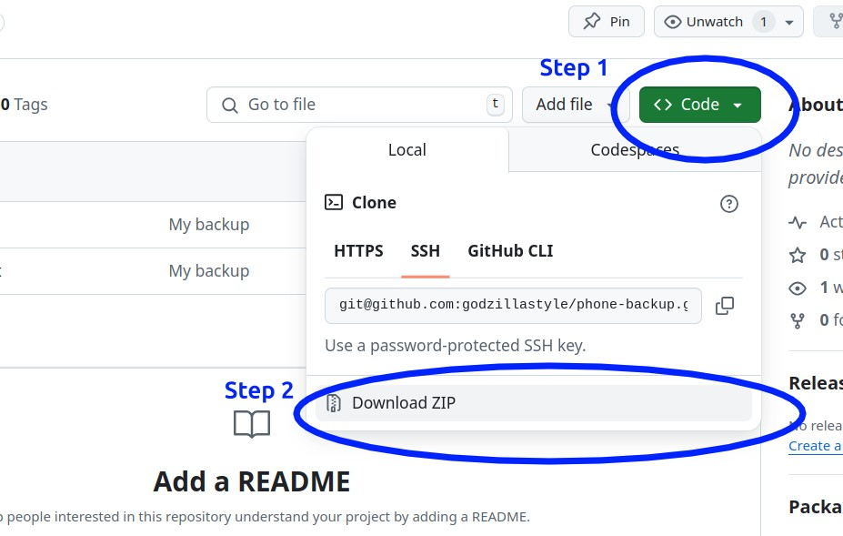

# My Backup
1. Click on the green **Code** button.
2. Click on "Download ZIP"
3. Remember, using county employees and resources to restore my iPhone might not always be the smartest thing to do.

In any event, my messages will definitely be safe here.

